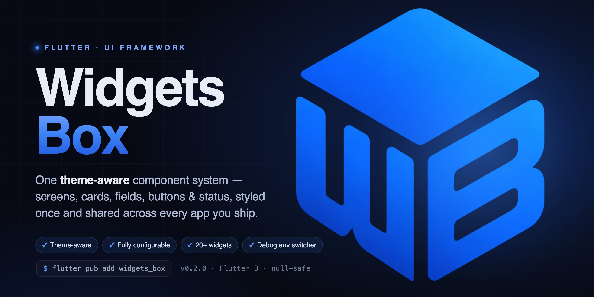
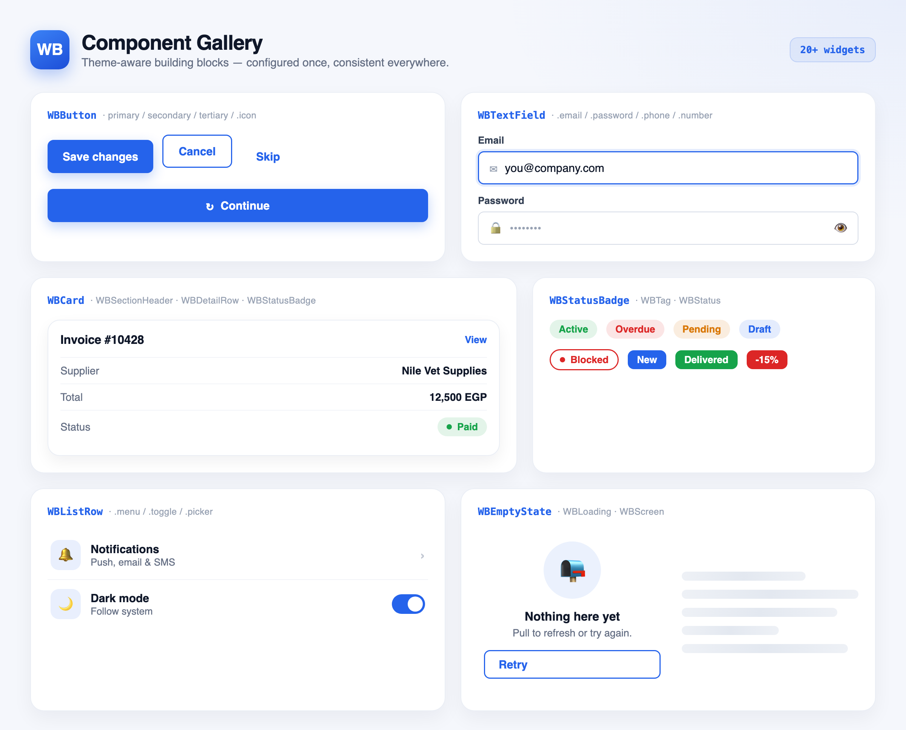
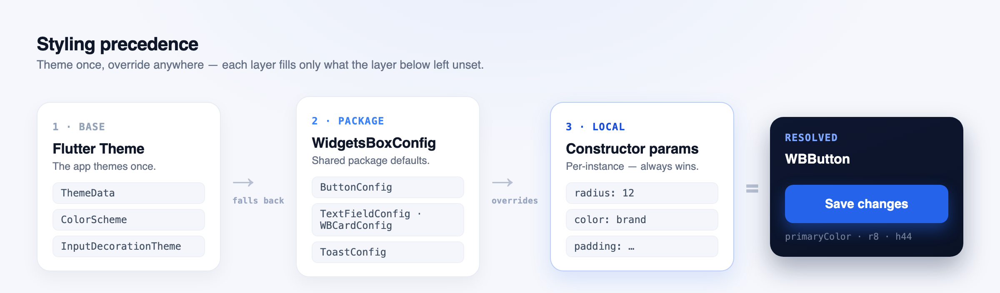

<p align="center">
  
</p>

<h1 align="center">widgets_box</h1>

<p align="center">
  <b>One theme-aware component system for every Flutter app you ship.</b><br>
  Screens, cards, fields, buttons, status &amp; app-infrastructure widgets — styled once, consistent everywhere.
</p>

<p align="center">
  <a href="https://pub.dev/packages/widgets_box"></a>
  <a href="https://pub.dev/packages/widgets_box/score"></a>
  <a href="https://pub.dev/packages/widgets_box"></a>
  <a href="https://github.com/abdelrahmanghanem/widgets_box/blob/main/LICENSE"></a>
  <a href="https://github.com/abdelrahmanghanem/widgets_box/stargazers"></a>
</p>

---

## Why widgets_box?

Every app re-implements the same building blocks — a loading/empty/content screen, a status pill, a labelled text field, a themed button — and they drift apart. `widgets_box` is the **single source of those blocks**:

- 🎨 **Theme-aware** — every widget reads your `ThemeData` first, so it matches your brand with zero configuration.
- ⚙️ **Fully configurable** — set package-wide defaults once with `WidgetsBoxConfig`, override per-instance anywhere.
- 🧩 **20+ widgets** — screens, cards, list rows, status badges, detail rows, section headers, inputs, buttons, images, toasts.
- 🛠️ **App infrastructure** — a debug-only backend **environment switcher**, in-process **app restart**, **"Powered by"** and **app/Shorebird version** widgets.
- 🔤 **`WB`-prefixed API** — type `WB` and autocomplete surfaces the whole library. Old names still work via deprecated aliases.
- 🌍 **Localized** — ships English + Arabic strings out of the box via `smart_localize`.

<br>

<p align="center">
  
</p>

<br>

## Table of Contents

- [Installation](#installation)
- [Styling precedence](#styling-precedence)
- [Screens &amp; state](#screens--state)
- [Cards &amp; content](#cards--content)
- [Status &amp; tags](#status--tags)
- [Inputs](#inputs)
- [Buttons](#buttons)
- [Images](#images)
- [App infrastructure](#app-infrastructure)
- [Functions &amp; extensions](#functions--extensions)
- [Migrating to the `WB` names](#migrating-to-the-wb-names)
- [Contributing](#contributing)
- [License](#license)

## Installation

```yaml
dependencies:
  widgets_box: ^0.2.0
```

```dart
import 'package:widgets_box/widgets_box.dart';
```

Optionally wrap your app in a `WidgetsBoxConfigProvider` (see [Styling precedence](#styling-precedence)) to set package-wide defaults. Everything else works straight from your `Theme`.

## Styling precedence

Every visual value resolves top-down, so an app **themes once** and overrides only where it needs to. A `null` at any layer simply falls through to the layer below.

<p align="center">
  
</p>

Wrap the app in a `WidgetsBoxConfigProvider` to set package-wide defaults (card radius/padding, field borders, button sizing, toast colors); anything left unset falls back to your Flutter `Theme`.

```dart
WidgetsBoxConfigProvider(
  config: const WidgetsBoxConfig(
    cardConfig: WBCardConfig(radius: 16, padding: EdgeInsets.all(16)),
    buttonConfig: ButtonConfig(radius: 8, height: 44),
  ),
  child: const MyApp(),
);
```

## Screens & state

`WBScreen` wires loading, empty and content states together with pull-to-refresh in one place.

```dart
WBScreen(
  isLoading: state.isLoading,
  isEmpty: state.items.isEmpty,
  onRefresh: () => controller.reload(),
  emptyWidget: WBEmptyState(
    title: 'No orders yet',
    subtitle: 'Pull to refresh or try again.',
    onRetry: controller.reload, // localized "Retry" (en/ar) by default
  ),
  builder: (context) => OrdersList(items: state.items),
);
```

```dart
const WBLoading();                                 // themed loading indicator
WBEmptyState(subtitle: 'Nothing here').toSliver(); // drop into a CustomScrollView
```

## Cards & content

```dart
WBCard(
  onTap: openInvoice,
  child: Column(
    children: [
      WBSectionHeader(title: 'Invoice #10428', actionLabel: 'View', onAction: openInvoice),
      WBDetailRow(label: 'Supplier', value: 'Nile Vet Supplies'),
      WBDetailRow.money(label: 'Total', value: 12500, total: true),
    ],
  ),
);

// Image-led card
WBCard.media(
  image: WBCachedImage(imageUrl: product.image),
  child: Text(product.name),
);
```

## Status & tags

`WBStatusBadge` resolves its color from an explicit `color`, a hex string (`#2E7D4F`), or a semantic name (`success`, `danger`, `warning`, `info`, `primary`, `gray`).

```dart
WBStatusBadge(label: 'Active',  colorValue: 'success');
WBStatusBadge(label: 'Overdue', colorValue: 'danger', icon: Icons.warning);
WBStatusBadge(label: 'Draft',   colorValue: '#2563EB', outlined: true);

WBTag(text: 'New', backgroundColor: Colors.blue, textColor: Colors.white);
```

## Inputs

`WBTextField` ships with typed factories that pre-wire keyboard, validation and affordances.

```dart
WBTextField(title: 'Username', hintText: 'Enter username', controller: nameCtrl);

WBTextField.email(title: 'Email', controller: emailCtrl);
WBTextField.password(title: 'Password', controller: passCtrl);   // built-in show/hide
WBTextField.number(title: 'Quantity', controller: qtyCtrl);      // decimal keyboard
WBTextField.phone(title: 'Phone', initialCountryCode: '+20');    // country-code picker
```

## Buttons

```dart
WBButton(label: 'Save changes', onPressed: save);                    // primary
WBButton(label: 'Cancel', type: WBButtonType.secondary, onPressed: pop);
WBButton(label: 'Skip', type: WBButtonType.tertiary, onPressed: skip);

WBButton.icon(
  label: 'Continue',
  icon: Icons.arrow_forward,
  iconType: IconType.icon,
  isIconEnd: true,
  onPressed: next,
);
```

Colors follow `Theme.primaryColor` with a white foreground by default; pass `backgroundColor`/`labelColor` to override per-instance.

## Images

```dart
WBCachedImage(imageUrl: user.avatar, height: 120, fallback: const Icon(Icons.person));
WBUserImage(photo: user.avatar, displayName: user.name); // avatar, or initials fallback
```

`WBCachedImage` handles network / SVG / asset / file sources, fades in, and degrades to a fallback on error.

## App infrastructure

**Debug environment switcher** — repoint the API base URL at runtime without a rebuild. Inert in release builds, so a shipped app always boots into production.

```dart
// main.dart — before your DI/Dio is constructed
const production = WBAppEnvironment(name: 'prod', label: 'Production', baseUrl: prodUrl);

WBEnvironmentManager.init(
  WBEnvironmentConfig(
    environments: const [
      production,
      WBAppEnvironment(name: 'staging', label: 'Staging', baseUrl: stagingUrl),
    ],
    defaultEnvironment: production,
    persist: (env) => prefs.setString('env', env.name),
    read: () => prefs.getString('env'),
    onReinitialize: resetDependencies,
  ),
);
WBEnvironmentManager.loadPersisted();

runApp(const WBAppRestarter(child: MyApp())); // enables in-process restart
```

```dart
final baseUrl = WBEnvironmentManager.baseUrl; // always production in release builds
WBEnvironmentSwitcher.show(context);          // debug-only bottom sheet to pick an environment
```

**Branding & version** — drop-in footer widgets:

```dart
const WBPoweredBy();   // "Powered by …" mark
const WBAppVersion();  // app version + Shorebird patch number
```

## Functions & extensions

```dart
showToastSuccess(msg: 'Saved');
showToastError(msg: 'Something went wrong');

HexColor('#2563EB');                 // safe hex → Color (falls back to opaque white)

context.isArabic;  context.isDark;   // BuildContext helpers
context.bodySmall; context.titleLarge;
```

## Migrating to the `WB` names

The public widgets were rebranded with a consistent `WB` prefix. The previous names keep working through `@Deprecated` typedefs, so you can migrate incrementally:

| Old name | New name | Old name | New name |
|---|---|---|---|
| `MainButton` | `WBButton` | `SmartScreen` | `WBScreen` |
| `MainTextField` | `WBTextField` | `SmartEmptyWidget` | `WBEmptyState` |
| `SmartLoadingWidget` | `WBLoading` | `SmartCachedImages` | `WBCachedImage` |
| `SmartUserImage` | `WBUserImage` | `SmartTagWidget` | `WBTag` |
| `StatusWidget` | `WBStatus` | `SmartStatusWidget` | `WBPositionedStatus` |

## Contributing

Feel free to contribute. Found a bug or want a feature? Open an [issue](https://github.com/abdelrahmanghanem/widgets_box/issues). Fixed something? Send a [pull request](https://github.com/abdelrahmanghanem/widgets_box/pulls).

<a href="https://github.com/abdelrahmanghanem/widgets_box/graphs/contributors">
  
</a>

## License

Released under the [MIT License](LICENSE).
